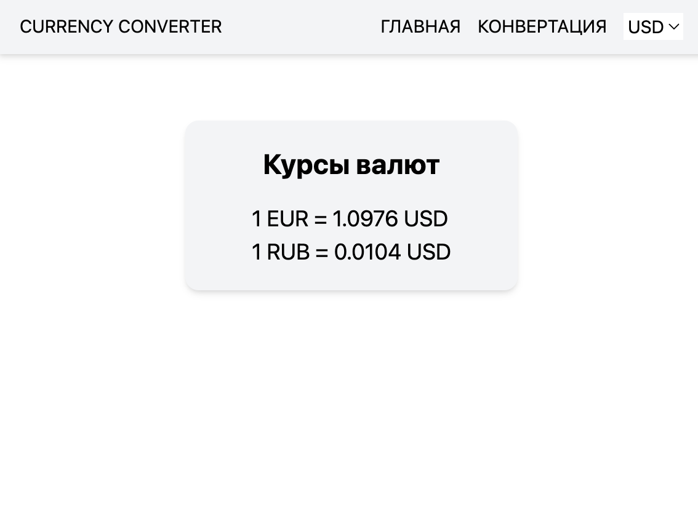
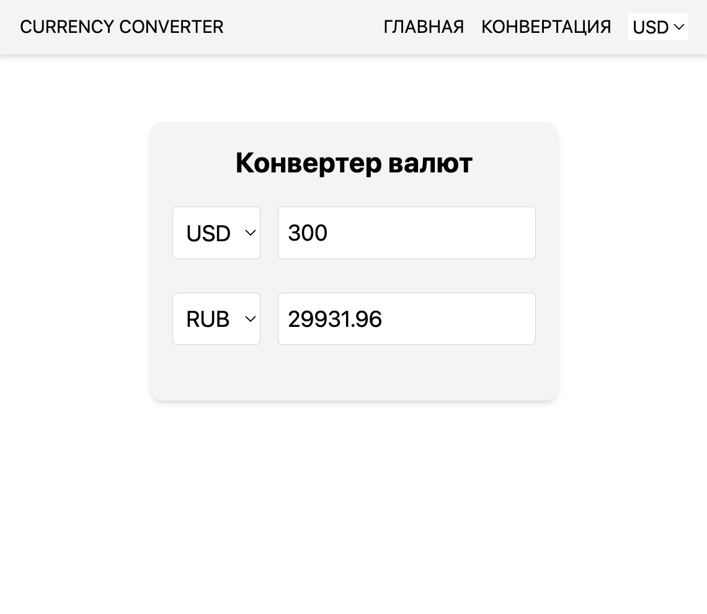

# Currency converter

> Simple currency converter with 2 screens and fetching data from https://status.neuralgeneration.com/api/currency

## Preview




## Features

- Vue 3
- Typescript
- Pinia
- Vue-router
- Vite

## Setup

```
npm install
```

```
npm run start
```
